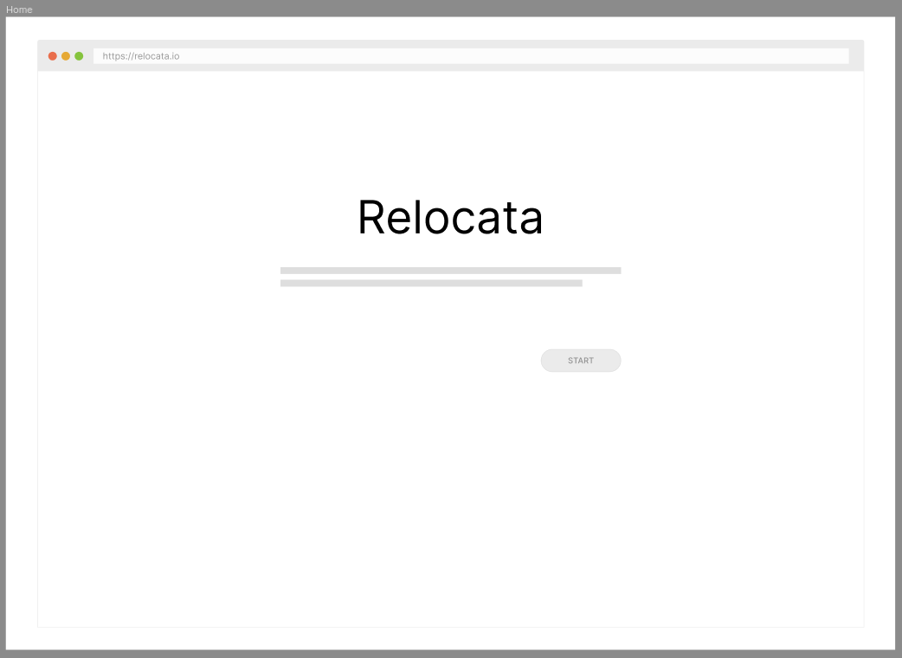
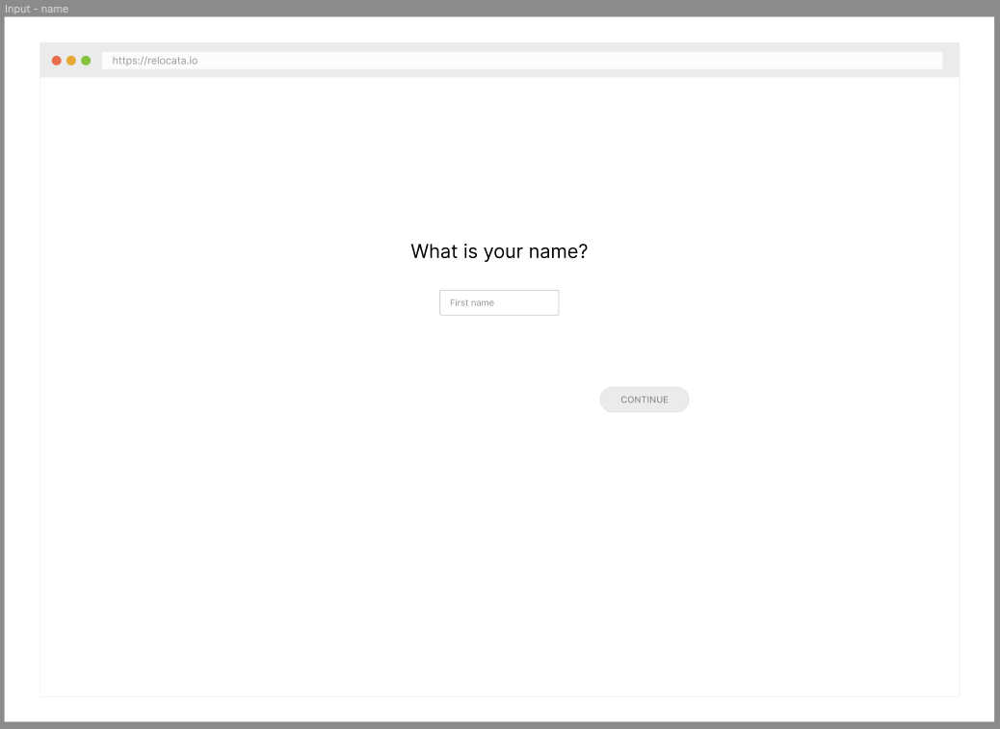
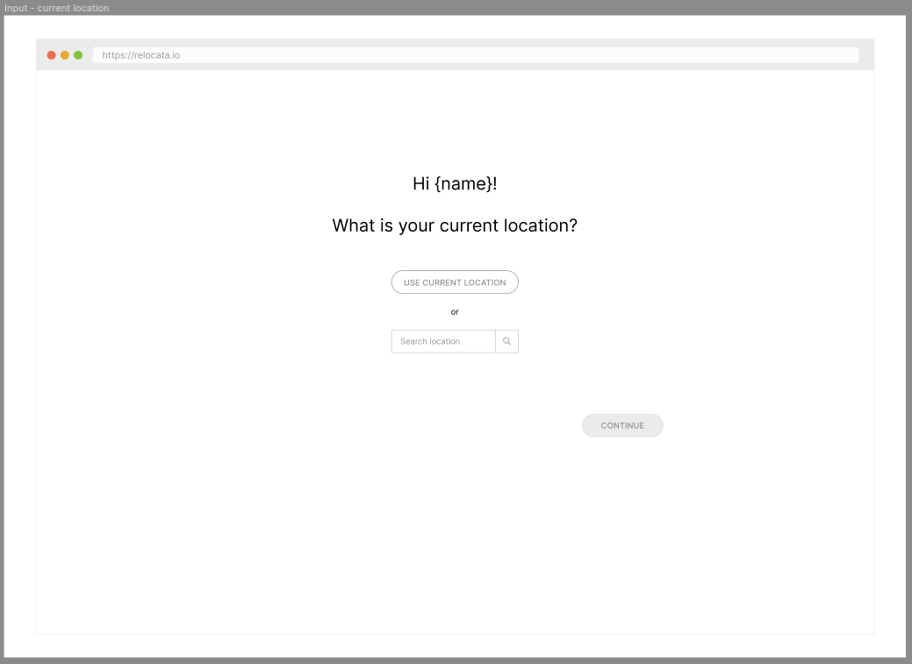
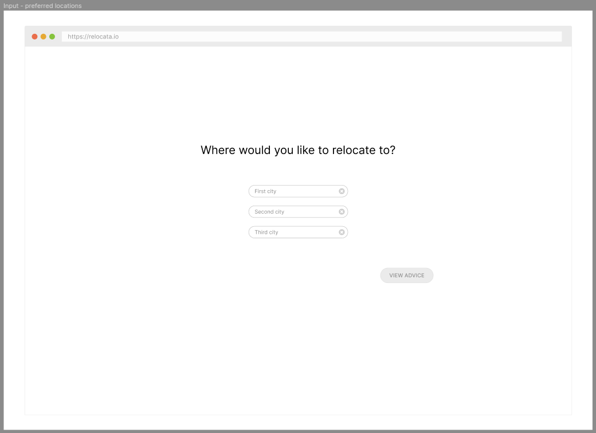
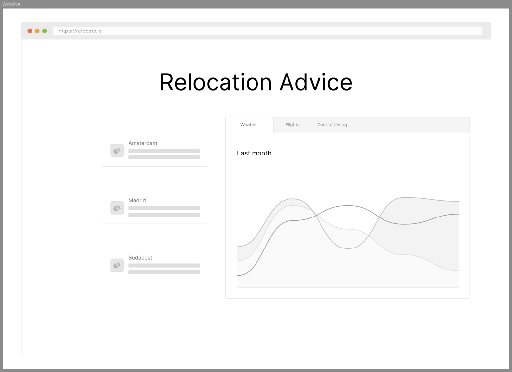

# [Relocata](https://martijnrondeel.github.io/relocata/)

## Case

Jamie's vacation is about to end. She works at an international company, so she can choose another office to work from: either Amsterdam, Madrid, or Budapest. Help her choose which office to go to – she’d like someplace with good weather or cheap flights (or both).

## Tech

- React, Typescript, Jest, Webpack
- ESLint, Prettier

## Mockups

Made in Figma.

### Home screen

### Name input

### Current location input

### Preferred locations input

### Advice screen

## Requirements

- [x] User should be able to enter name
- [x] User should be able to enter current location
  - [x] Search for location
  - [x] Button to request location from browser and auto-fill
- [x] User should be able to enter up to 3 preferred locations
  - [x] City names should be autocompleted
- [ ] User should be able to see weather information
- [x] User should be able to see flights information
- [x] User should be able to see city information
- [ ] User should be able to reset application state and start over

## Further improvements possible

- Save application state in a cookie
- Implement proper form validation for name and city inputs
- Catch API errors and show status to the user
- Run tests on push with GitHub actions (CI/CD)
- If server-side was a possibility:
  - Implement rate-limiting
  - Put API keys in environment variables and use .env file for development
